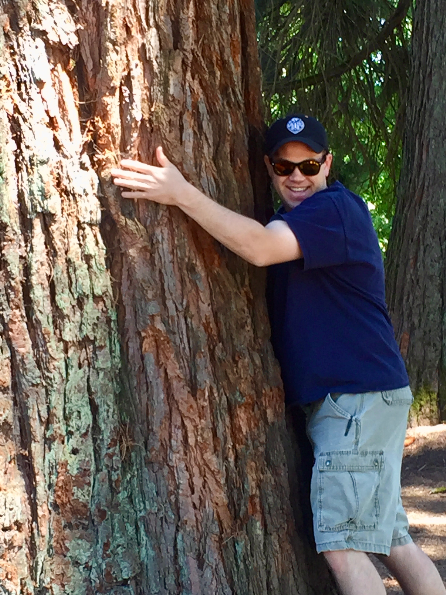

.. ACSpype documentation master file, created by
   sphinx-quickstart on Thu May  8 16:10:43 2025.
   You can adapt this file completely to your liking, but it should at least
   contain the root `toctree` directive.

ACSpype Documentation
=====================

.. '_modules' is creating the list of modules, but there is not direct navigation to the modules page itself, 
   so we may need to add a link to the modules page so that we don't have hidden functionality.
   Do we keep the .md overall headers, on the site itself the overall headers and the subsequent subheaders lead to the same page,
   just at different scroll positions. Leaving modules.rst as is for now. Build does not include it in the final output.

.. toctree::
   :maxdepth: 4
   :caption: Contents:

   README.md
   modules.rst
   acspype.core
   acspype.utils.rst
   acspype.rst
   PROCESSING.md
   NAMING_CONVENTIONS.md
   REFERENCE_MATERIAL.md
